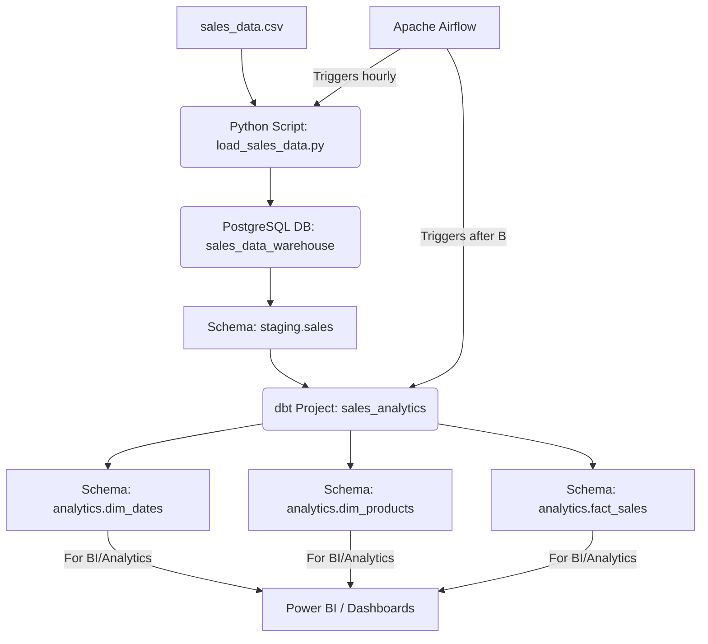

# Sales-Analytics-Pipeline

This project demonstrates building a modern data engineering pipeline with industry-standard tools. It extracts raw sales data, cleans and transforms it into a structured analytical data model, and orchestrates the process using Apache Airflow.

---

## Table of Contents

1. [Project Overview](#project-overview)
2. [Architecture](#architecture)
3. [Goals](#goals)
4. [Technologies Used](#technologies-used)
5. [Getting Started](#getting-started)
6. [Future Work](#future-work)

---

## Project Overview

This project implements an **ELT (Extract, Load, Transform)** data pipeline for sales data. The goal is to process raw sales transactions from a CSV file, load them into a staging area, and transform them into a Kimball-style dimensional model (Fact and Dimension tables) for analytics. The workflow is automated using Apache Airflow.

---

## Architecture

The pipeline follows an **ELT** pattern:

- **Extract & Load (EL):**  
  - A Python script reads `sales_data.csv`, performs basic cleaning, and loads data into the `staging.sales` table in PostgreSQL.  
  - Triggered by Airflow.

- **Transform (T):**  
  - dbt models read from `staging.sales` and create `dim_dates`, `dim_products`, and `fact_sales` tables in the `analytics` schema.  
  - Also triggered by Airflow.

- **Orchestration:**  
  - Apache Airflow schedules and monitors the ingestion and transformation steps.

**Pipeline Diagram:**



---

## Goals

- **Ingest Raw Data:** Load `sales_data.csv` into a PostgreSQL staging table.
- **Initial Data Cleaning:** Handle data types and missing values on load.
- **Transform Data:** Build a dimensional model (fact and dimension tables) with dbt.
- **Orchestrate Workflow:** Automate the ELT process via Apache Airflow.
- **Demonstrate Core DE Skills:** Show proficiency in Python, SQL, PostgreSQL, Docker, Airflow, and dbt.

---

## Technologies Used

| Category         | Tool/Library           | Purpose                                    |
|------------------|-----------------------|--------------------------------------------|
| Language         | Python                | Scripting and orchestration                |
| Data Manipulation| pandas                | Read/clean CSV data                        |
| DB Connectivity  | sqlalchemy, psycopg2  | Connect/load to PostgreSQL                 |
| Database         | PostgreSQL            | Raw & transformed data storage             |
| Orchestration    | Apache Airflow        | Schedule & monitor pipeline                |
| Transformation   | dbt, dbt-postgres     | SQL-based data modeling                    |
| Containerization | Docker, Docker Compose| Dev environment, service isolation         |
| Visualization    | Power BI (future)     | BI/dashboarding                            |

---

## Getting Started

1. **Clone this repository**
   ```bash
   git clone https://github.com/yourusername/Sales-Analytics-Pipeline.git
   cd Sales-Analytics-Pipeline
   ```

2. **Copy your raw sales data**
   - Place your `sales_data.csv` into the `data/` folder.

3. **Run with Docker Compose**
   ```bash
   docker-compose up --build
   ```

4. **Access Airflow**
   - Visit [localhost:8080](http://localhost:8080) to view and manage DAGs.

5. **Monitor Transformations**
   - dbt transformations and model outputs are in the PostgreSQL `analytics` schema.

---

## Future Work

- Add Power BI dashboards/visualizations.
- Implement tests and data quality checks.
- Add support for incremental loads and new data sources.

---
